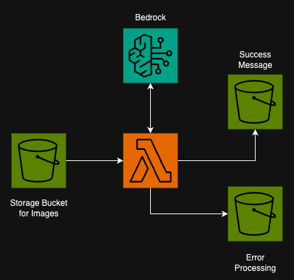

# Image processing service

This Terraform project deploys a Lambda that will be triggered when a document is placed in a "triggering" s3 bucket.
That image is then processed through Amazon Bedrock through a static image validation prompt

## CICD Pipeline
This project uses CodePipeline to execute Terraform deployments. The CICD pipeline is triggered when commits are made
to the `main` branch of this CodeCommit repo. See the [buildspec.yml](./buildspec.yml) for the detailed deployment steps.

A separate pipeline is configured to destroy the infrastructure using [buildspec-destroy](./buildspec-destroy.yml). It must be manually
approved before it will.

## Architecture Diagram UPDATE

More details under [this README](./docs/README.md)
